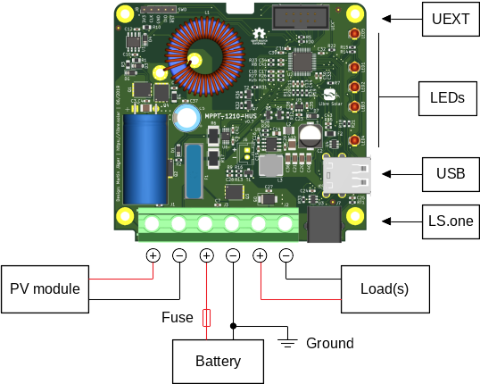

# Installation

The following image describes the different terminals and interfaces of the charge controller PCB.

The charge controller features a high-side load switch and should be grounded at the negative battery terminal. There should be no additional grounding of the system. Most important, the wires to the solar panel should not be connected anywhere else except for the charge controller PV input.

## Connection order

1. Connect the battery to the battery port. As the fuse inside the charge controller cannot protect the wire between battery and charge controller, an additional fuse should be installed close to the poitive battery terminal. Small sparks during connection of the battery are normal and acceptable.

2. Cover the solar panel and afterwards connect the wires to the PV input terminal.

3. As a last step, connect the loads like lights, etc. to the load output.

The charge controller is now ready to use.

Disconnection should be done in opposite order.

## Compatible batteries

This charge controller can charge any battery with a nominal voltage of 12 V.

The default settings are safe for all lead-acid batteries, but should be adjusted according to the information provided in the battery datasheet.

For Li-ion batteries you need to configure the voltage setpoints manually using the LS.one serial interface. You must also deactivate the float charging stage.

## Solar modules

The MPPT algorithm can automatically adapt to different types of modules. Any module with 36 to 60 cells in series is suitable. The maximum open circuit voltage even under cold ambient temperature conditions must be below 50 V. Even though the controller automatically derates its power in case of overload, the nominal power under standard test conditions (STC) of the module should not exceed 150 W.

Solar modules need direct sunlight to work properly. Indirect light and partial shading will reduce the performance. Make sure to face the module towards the sun.

Read the datasheet of your solar module for more information about the specifications.

## Mounting

Fix the device vertical at non-flammable surface with the power terminals facing downwards.

The charge controller should be mounted as close to the battery as possible, but avoiding any contact with battery acid or gas emissions.

Never mount the device in a fuel storage compartment, as the fuse can create sparks.

## Wiring and Grounding

The minimum wire cross-section should be 2.5 mm². It is recommended to use 6 mm² wires, which is the maximum the terminals can handle.

The length between charge controller and battery should be less than 1 m.

Use suitable fuses in the wiring harness connected to the load terminal if the cross-section is decreased.

If necessary, only ground the energy system at a single point, which should be at the negative battery terminal.
